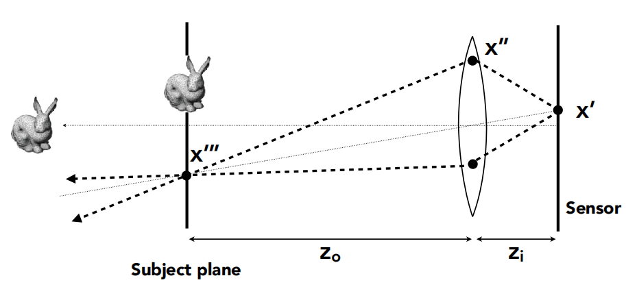

# Defocus Blur

散焦模糊（Defocus Blur），在摄影界被叫做景深（Depth of Field）。

在讨论景深之前，需要先了解一个理想薄透镜有哪些性质：

1. 所有平行射入透镜的光都会集中于一点，称该点为焦点（过交点一定会变平行光）；
2. 所有从焦点射入透镜的光都会平行射出（平行光一定会过交点）；
3. 焦距可以被随意改变（现实中通常都是由一组透镜组来模拟焦距的改变）；

利用这些性质可以得到理想透镜的成像规律，对于一个通过透镜的成像物体来说，其物距 $z_o$
，像距 $z_i$ 和焦距 $f$ 之间存在如下图的关系：

<div align="center"></div>

$$
\frac{1}{f} = \frac{1}{z_i} + \frac{1}{z_o}
$$

这就是著名的高斯薄透镜公式（Gaussian Thin Lens Equation）。

在了解透镜成像的规律之后，就可以进一步来理解景深所产生的原因了：当一个传感器平面不在一个物体真正精确的成像平面之上时(即之前所提到到像距 $z_i$ 的平面)，便会出现模糊。

在现实世界中的相机中，焦距是由镜头和胶片/传感器之间的距离控制的。这就是为什么当你改变对焦时，你会看到镜头相对于相机移动(这也可能发生在你的手机相机上，但传感器会移动)。光圈（Aperture）是一个孔，用来有效地控制镜头的大小。对于一台真正的相机来说，如果你需要更多的光线，你可以把光圈调大，这样就会产生更多的散焦模糊。

<div align="center"></div>

事实上，我们不用模拟任何摄像机内部的东西，这些都没必要。我们只要从一个虚拟的透镜范围中发射光线到我们的摄像机平面就能模拟了，这个透镜与平面的距离成为焦距（focus_dist）。

```cpp
vec3 random_in_unit_disk() {
    while (true) {
        auto p = vec3(random_double(-1,1), random_double(-1,1), 0);
        if (p.length_squared() >= 1) continue;
        return p;
    }
}
```

<div align="center"></div>

```cpp
ray get_ray(double s, double t) {
    vec3 rd = lens_radius * random_in_unit_disk();
    vec3 offset = u * rd.x() + v * rd.y();

    return ray(
        origin + offset,
        lower_left_corner + s*horizontal + t*vertical - origin - offset
    );
}
```

## My Understanding

网上很多笔记或者博客均没有很好解释出，代码里只是从一个圆形区域随机选一点发射光线为什么就能做到某一个距离的平面内清晰而其前后都模糊？为此，下面我记录一下自己的理解：

之前我们所有的光线都是从 `Lookfrom` 发出的，但现在加入了散焦模糊, 所有光线都从一个以 `Lookfrom` 点为中心的虚拟透镜发出，这个透镜的半径越大, 图像就越模糊。

在之前的光线追踪实现中，可以认为光圈 Aperture 的半径为 0 ，这就好像是一个简易的小孔成像。但现在考虑到景深问题后，需要将 Aperture 的半径增大，从而获得散焦模糊的效果。

<div align="center"></div>

如上图（a）所示，现实世界中的胶片或传感器在我们的光线追踪渲染器中可以认为是不存在的，因为我们只是将成像平面，也就是图中的 Focal Plane 的结果作为屏幕像素的输出结果，且原本被认为是摄像机的 `Lookat` 只是图中的小孔。

为了模拟出景深的效果，如上图（b）中所示，需要将原本小孔变为一个薄透镜，且这个透镜与成像平面的距离就是焦距 `focus_dist` 。这样，我们将摄像机想象为一个薄透镜，而成像平面被放在的焦距的位置。因此，不管从圆形区域任何一点发射一根光线，最终都会打在成像平面中的同一个像素的位置，从而模拟出了光线通过薄透镜最终聚焦到景深位置的效果。

此外需要注意的是，在之前的代码中，由于固定了摄像机到成像平面的距离 $f$ 为 1 ，而此前在代码中只是简单的令 `h = tan(theta / 2)` ，但在视场的定义中有：

$$
\tan{\frac{fovY}{2}} = \frac{h}{f}
$$

因此，为了将成像平面放在景深对应的位置，也就是成像清晰的位置，这里的 $f$ 应当更改为焦距 `focus_dist` 。

这样就得到了最终的摄像机类：

```cpp
class camera {
    public:
        camera(
            point3 lookfrom,
            point3 lookat,
            vec3   vup,
            double vfov, // vertical field-of-view in degrees
            double aspect_ratio,
            double aperture,
            double focus_dist
        ) {
            auto theta = degrees_to_radians(vfov);
            auto h = tan(theta/2);
            auto viewport_height = 2.0 * h;
            auto viewport_width = aspect_ratio * viewport_height;

            w = unit_vector(lookfrom - lookat);
            u = unit_vector(cross(vup, w));
            v = cross(w, u);

            origin = lookfrom;
            horizontal = focus_dist * viewport_width * u;
            vertical = focus_dist * viewport_height * v;
            lower_left_corner = origin - horizontal/2 - vertical/2 - focus_dist*w;

            lens_radius = aperture / 2;
        }


        ray get_ray(double s, double t) const {
            vec3 rd = lens_radius * random_in_unit_disk();
            vec3 offset = u * rd.x() + v * rd.y();

            return ray(
                origin + offset,
                lower_left_corner + s*horizontal + t*vertical - origin - offset
            );
        }

    private:
        point3 origin;
        point3 lower_left_corner;
        vec3 horizontal;
        vec3 vertical;
        vec3 u, v, w;
        double lens_radius;
};
```

## The End

[返回主页](../README.md)
