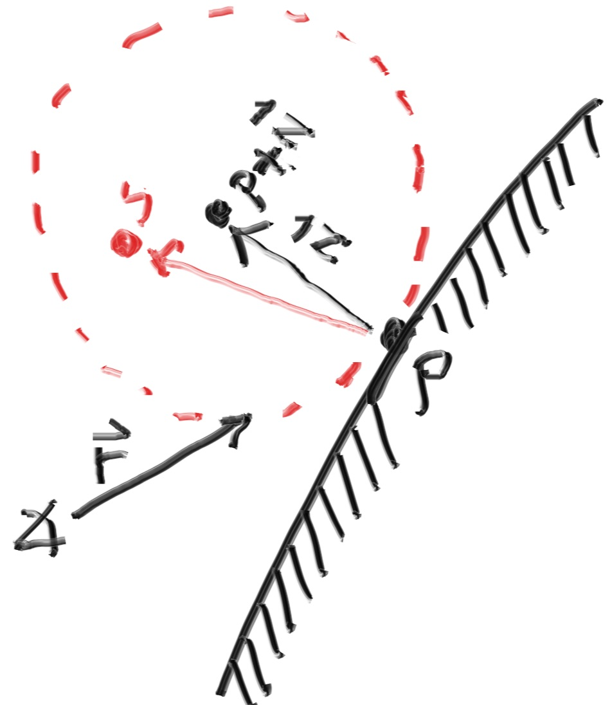

# Diffuse Reflection

漫反射材质不仅仅接受其周围环境的光线, 还会在散射时使光线变成自己本身的颜色。光线射入漫反射材质后, 其反射方向是随机的。

## A Simple Diffuse Material

首先是一种简单的方法，但并不是数学严谨的理想的 Lambertian 方法，其只是一种近似。

假设有两个单位球相切于点 $\boldsymbol P$ ，这两个单位球的球心分别为 $\boldsymbol P + \boldsymbol{n}$ 和 $\boldsymbol P - \boldsymbol{n}$ ，其中 $\boldsymbol{n}$ 是球体表面的法向量。球心为 $\boldsymbol P - \boldsymbol{n}$ 的球被认为是在表面内部，而球心为 $\boldsymbol P + \boldsymbol{n}$ 的球被认为是在表面外部。选择和入射光线原点在同一侧表面的那个单位球，并从球中随机选取一点 $\boldsymbol S$ ，并从相交点 $\boldsymbol P$ 向着随机选取的点 $\boldsymbol S$ 发射一条光线，这条光线就是反射出的光线 $\boldsymbol S - \boldsymbol{P}$ 。

<div align="center"></div>

具体的实现中，需要一个算法来生成球体内的随机点。一种最简单有效的方法叫做***拒绝采样***。首先，在一个x,y 和 z 取值范围为 -1 到 1 的单位立方体中随机选取一个随机点，如果这个点在球外就重新生成直到该点在球内：

```cpp
inline static vec3 random(double min, double max) {
    return vec3(random_double(min,max), random_double(min,max), random_double(min,max));
}

vec3 random_in_unit_sphere() {
    while (true) {
        auto p = vec3::random(-1,1);
        if (p.length_squared() >= 1) continue;
        return p;
    }
}
```

这样我们就得到了需要的漫反射光线：

```cpp
hit_record rec;

if (world.hit(r, 0, infinity, rec)) {
    point3 target = rec.p + rec.normal + random_in_unit_sphere();
    Ray r(rec.p, target - rec.p);
}
```

## Lambertian Reflection

拒绝法生成的点是单位球体积内的的随机点, 这样生成的向量大概率上会和法线方向相近, 并且极小概率会沿着入射方向反射回去。这个分布律的表达式有一个 $\cos^3{\phi}$  的系数, 其中 $\phi$ 是反射光线与法向量的夹角。这样当光线从一个离表面很小的角度射入时, 也会散射到一片很大的区域, 对最终颜色值的影响也会更低。

然而, 事实上的 Lambertian 的分布律并不是这样的, 它的系数是 $\cos{\phi}$ 。真正的 Lambertian 散射后的光线距离法相比较近的概率会更高, 但是分布律会更加均衡。这是因为我们选取的是单位球面上的点。我们可以通过在单位球内选取一个随机点, 然后将其单位化来获得该点。

<div align="center"></div>

```cpp
vec3 random_unit_vector() {
    return unit_vector(random_in_unit_sphere());
}
```

当然也可以通过极坐标形式来获得该点，不过上述方法似乎效率更高：

```cpp
vec3 random_unit_vector() {
    auto a = random_double(0, 2*pi);
    auto z = random_double(-1, 1);
    auto r = sqrt(1 - z*z);
    return vec3(r*cos(a), r*sin(a), z);
}
```

这样漫反射光线的方向就从单位圆内一点变成了单位圆上一点：

```cpp
hit_record rec;

if (world.hit(r, 0, infinity, rec)) {
    point3 target = rec.p + rec.normal + random_unit_vector();
    Ray r(rec.p, target - rec.p);
}
```

## An Alternative Diffuse Formulation

一种更直观的方法是， 直接从入射点开始选取一个随机的方向，然后再判断是否在法向量所在的那个半球。在使用 Lambertian 漫发射模型前,，早期的光线追踪论文中大部分使用的都是这个方法：

```cpp
inline Vec3 random_in_hemisphere(const Vec3& normal) {
    Vec3 in_unit_sphere = random_in_unit_sphere();
    if (dot(in_unit_sphere, normal) > 0.0) // In the same hemisphere as the normal
        return in_unit_sphere;
    else
        return -in_unit_sphere;
}
```

```cpp
hit_record rec;

if (world.hit(r, 0, infinity, rec)) {
    point3 target = rec.p + random_in_hemisphere(rec.normal);
    Ray r(rec.p, target - rec.p);
}
```

## The End

[返回主页](../README.md)
