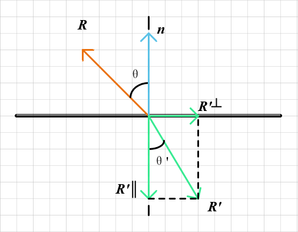

# Refraction & Fresnel term

## Snell's Law

折射法则是由 Snell 法则定义的：

$$
\eta \cdot \sin{\theta} = \eta^\prime \cdot \sin{\theta^\prime}
$$

其中 $\theta$ 和 $\theta^\prime$ 分别是入射光线和折射光线与法线的夹角， $\theta$ 和 $\theta^\prime$ （读作eta 和 eta prime）是介质的折射率（通常空气为 1.0、玻璃为 1.3-1.7、钻石为 2.4）。

<div align="center"></div>

以入射和折射方向均“朝外”，且均为单位向量为例。在折射介质部分有一条折射光线 $R^\prime$ 和一个法向量 $n^\prime$ ，其夹角为 $\theta^\prime$ 。我们可以将 $R^\prime$  分解成垂直和水平与法向量的两个分量：

$$
\begin{equation}
R^{\prime} = R^{\prime}_{\perp} + R^{\prime}_{\parallel}
\end{equation}
$$

首先对于 $R^{\prime}_\perp$ ，其模长为：

$$
\begin{equation}
|R^{\prime}_\perp| = \sin{\theta^\prime} \cdot |R^\prime| = \sin{\theta^\prime}
\end{equation}
$$

$R^{\prime}_\perp$ 的方向也就是水平方向，可以用入射向量 $R$ 和法线向量 $n$ 求出。设 $R$ 在垂直于 $n$ 的分量为 $R_\perp$ ，平行于法线向量的 $R_\parallel$ ：

$$
\begin{equation}
\begin{aligned}
R_\parallel &= \cos{\theta} \cdot n\\
            &= (R \cdot n) \cdot n
\end{aligned}
\end{equation}
$$

$$
\begin{equation}
\begin{aligned}
R_\perp     &= R - R_\parallel \\
            &= R - (R \cdot n) \cdot n \\
\end{aligned}
\end{equation}
$$

$$
\begin{equation}
|R_\perp| = \sin{\theta}
\end{equation}
$$

结合(2)(4)(5)式有：

$$
\begin{equation}
\begin{split}
R^{\prime}_\perp &= |R^{\prime}_\perp| \cdot \frac{-R_\perp}{|R_\perp|}\\
                 &= \frac{\sin{\theta^\prime}}{\sin{\theta}} ((R \cdot n) \cdot n - R) \\
                 &= \frac{\eta}{\eta^\prime} (\cos{\theta} \cdot n - R)
\end{split}
\end{equation}
$$

再由(1)(6)式有：

$$
\begin{equation}
\begin{aligned}
R^{\prime}_{\parallel} = - \sqrt{1 - \left|R^{\prime}_{\perp} \right|^2} \cdot n
\end{aligned}
\end{equation}
$$

根据上述公式, 我们就能写出计算折射光线 $R^\prime$ 的函数（代码中 $R$ 方向与推导相反）：

```cpp
vec3 refract(const vec3& uv, const vec3& n, double etai_over_etat) {
    auto cos_theta = fmin(dot(-uv, n), 1.0);
    vec3 r_out_perp =  etai_over_etat * (uv + cos_theta*n);
    vec3 r_out_parallel = -sqrt(fabs(1.0 - r_out_perp.length_squared())) * n;
    return r_out_perp + r_out_parallel;
}
```

## Fresnel term & Christophe Schlick approximation

菲涅尔现象描述的是对于绝缘体而言，反射率随着入射向量与法线向量的夹角 $\theta$ 不断增大而增大的现象。形象来说，就是当从一个陡峭的角度看向一面玻璃时，玻璃就会变得像一面镜子一样反射出远处的物体。

通常，计算菲涅尔现象的方式为：

$$
R_s = \left|\frac{n_1 \cos{\theta_i} - n_2 \cos{\theta_t}}{n_1 \cos{\theta_i} + n_2 \cos{\theta_t}} \right|^2
= \left| \frac{n_1 \cos{\theta_i} - n_2 \sqrt{1 - (\frac{n_1}{n_2} \sin{\theta_i})^2}}{n_1 \cos{\theta_i} + n_2 \sqrt{1 - (\frac{n_1}{n_2} \sin{\theta_i})^2}} \right|^2
$$

$$
R_p = \left|\frac{n_1 \cos{\theta_t} - n_2 \cos{\theta_i}}{n_1 \cos{\theta_t} + n_2 \cos{\theta_i}} \right|^2
= \left| \frac{n_1 \sqrt{1 - (\frac{n_1}{n_2} \sin{\theta_i})^2} - n_2 \cos{\theta_i}}{n_1 \sqrt{1 - (\frac{n_1}{n_2} \sin{\theta_i})^2} + n_2 \cos{\theta_i}} \right|^2
$$

$$
R_{eff} = \frac{1}{2} (R_s + R_p)
$$

```cpp
// [comment]
// Compute Fresnel equation
//
// \param I is the incident view direction
//
// \param N is the normal at the intersection point
//
// \param ior is the material refractive index
// [/comment]
float fresnel(const Vector3f &I, const Vector3f &N, const float &ior)
{
    float cosi = clamp(-1, 1, dotProduct(I, N));
    float etai = 1, etat = ior;
    if (cosi > 0) {  std::swap(etai, etat); }
    // Compute sini using Snell's law
    float sint = etai / etat * sqrtf(std::max(0.f, 1 - cosi * cosi));
    // Total internal reflection
    if (sint >= 1) {
        return 1;
    }
    else {
        float cost = sqrtf(std::max(0.f, 1 - sint * sint));
        cosi = fabsf(cosi);
        float Rs = ((etat * cosi) - (etai * cost)) / ((etat * cosi) + (etai * cost));
        float Rp = ((etai * cosi) - (etat * cost)) / ((etai * cosi) + (etat * cost));
        return (Rs * Rs + Rp * Rp) / 2;
    }
    // As a consequence of the conservation of energy, transmittance is given by:
    // kt = 1 - kr;
}
```

当然对于上述又大又丑的方程，很少有人会愿意直接使用它来计算。更多的选择是使用 Christophe Schlick 的多项式近似：

$$
R_0 = \left(\frac{n_1 - n_2}{n_1 + n_2} \right)^2 \\
R(\theta) = R_0 + (1 - R_0)(1 - \cos{\theta})^5
$$

```cpp
static double reflectance(double cosine, double ref_idx) {
    // Use Schlick's approximation for reflectance.
    auto r0 = (1-ref_idx) / (1+ref_idx);
    r0 = r0*r0;
    return r0 + (1-r0)*pow((1 - cosine),5);
}
```

## The End

[返回主页](../README.md)
