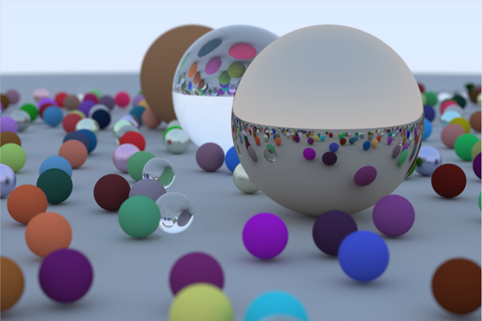

# Ray Tracer

这里是我在阅读 [_Ray Tracing in One Weekend_](https://raytracing.github.io/books/RayTracingInOneWeekend.html) 系列丛书时整理的笔记与代码实现。

## One Weekend

作为光线追踪三部曲的第一部分，有趣的是在整个场景中甚至都没有光源便已经实现了令人惊叹的效果。

此外，封面图中所有的小球均是随机生成的，因此网上所有人得到的结果图均是不同的。

第一部分中值得记录的知识点有：

- [Ray Casting](Notes/Ray_Casting.md)
- [Ray-Sphere Intersection](Notes/Intersection.md)
- [Diffuse Reflection](Notes/Diffuse_Reflection.md)
- [Specular Reflection](Notes/Specular_Reflection.md)
- [Refraction & Fresnel term](Notes/Refraction_Fresnel.md)
- [Depth of Field](Notes/Defocus_Blur.md)
